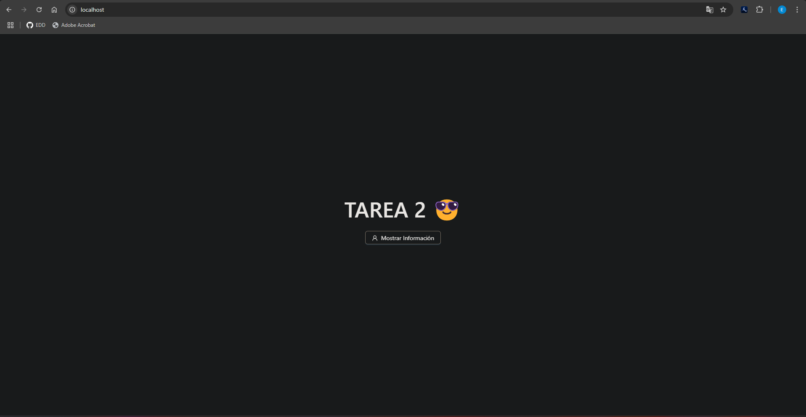
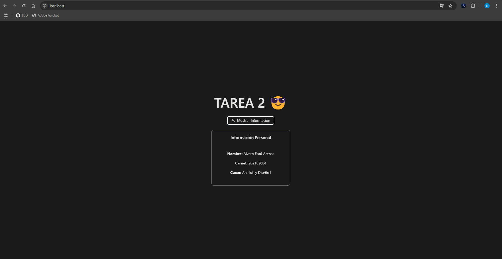

<h1 align="center"> TAREA 2 </h1>

<p align="center">
   
   </p>

*Universidad de San Carlos de Guatemala*  
*Escuela de Ingeniería en Ciencias y Sistemas, Facultad de Ingenieria*  
*Analisis y Diseño de Sistemas 1, 1er. Semestre 2025.*  
___

### **Dockerfile**
```Dockerfile
# Etapa 1: Build de la app
FROM node:18-alpine AS build

# Crea directorio de trabajo
WORKDIR /app

# Copia los archivos y paquetes
COPY package*.json ./

# Instala las dependencias
RUN npm install

# Copia el resto del código
COPY . .

# Construye la app (genera la carpeta dist)
RUN npm run build

# Etapa 2: Servirlo con Nginx
FROM nginx:alpine

# Copia el build a la carpeta pública de Nginx
COPY --from=build /app/dist /usr/share/nginx/html

# Copia una configuración básica de Nginx (opcional)
COPY nginx.conf /etc/nginx/conf.d/default.conf

# Expone el puerto 80
EXPOSE 80

# Inicia Nginx en modo foreground
CMD ["nginx", "-g", "daemon off;"] 

```
___

## ✅ **Resultado**
Pagina web interactiva con un botón que muestra una card con mi información personal y el nombre de este curso.
Para crear la imagen y contener de docker utilizamos el siguiente comando:

```bash
docker build -t tarea2 .
```




## ✅ **Tecnologias Utilizadas**
* React + Vite
* Docker
* Ant Design
## ✒️ Autor

* *202102864* - **Alvaro Esaú Arenas Gonzpazlez**